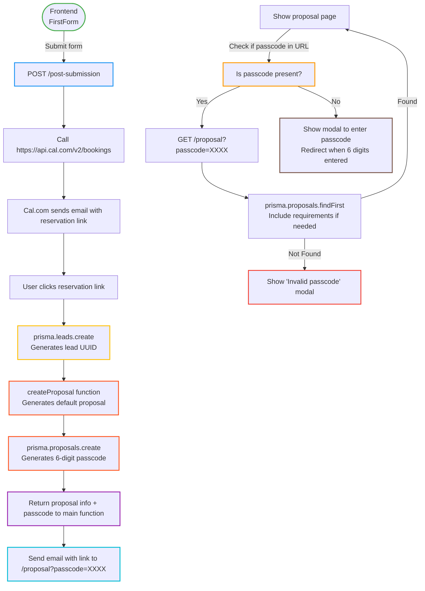

```mermaid
flowchart TB
    FE(["Frontend<br/>FirstForm"]) -->|Submit form| API["POST /post-submission"]

    API --> CAL["Call https://api.cal.com/v2/bookings"]
    CAL --> EMAIL_CAL["Cal.com sends email with reservation link"]

    EMAIL_CAL --> LINK["User clicks reservation link"]
    LINK --> LEAD["prisma.leads.create<br/>Generates lead UUID"]

    LEAD --> PROPOSAL["createProposal function<br/>Generates default proposal"]
    PROPOSAL --> PROPOSAL_CREATE["prisma.proposals.create<br/>Generates 6-digit passcode"]

    PROPOSAL_CREATE --> RETURN["Return proposal info + passcode to main function"]
    RETURN --> EMAIL_USER["Send email with link to /proposal?passcode=XXXX"]

    %% Proposal page view with passcode logic
    FE2(["Frontend<br/>/proposal page"]) -->|Check if passcode in URL| CHECK_PASS["Is passcode present?"]
    CHECK_PASS -->|Yes| API2["GET /proposal?passcode=XXXX"]
    CHECK_PASS -->|No| MODAL_ENTRY["Show modal to enter passcode<br/>Redirect when 6 digits entered"]

    API2 --> FETCH_DB["prisma.proposals.findFirst<br/>Include requirements if needed"]
    FETCH_DB -->|Found| FE2["Show proposal page"]
    FETCH_DB -->|Not Found| MODAL_INVALID["Show 'Invalid passcode' modal"]

    style FE stroke-width:2px,stroke:#4CAF50
    style API stroke-width:2px,stroke:#2196F3
    style LEAD stroke-width:2px,stroke:#FFC107
    style PROPOSAL stroke-width:2px,stroke:#FF5722
    style PROPOSAL_CREATE stroke-width:2px,stroke:#FF5722
    style RETURN stroke-width:2px,stroke:#9C27B0
    style EMAIL_USER stroke-width:2px,stroke:#00BCD4
    style CHECK_PASS stroke-width:2px,stroke:#FF9800
    style MODAL_ENTRY stroke-width:2px,stroke:#795548
    style MODAL_INVALID stroke-width:2px,stroke:#F44336

```
